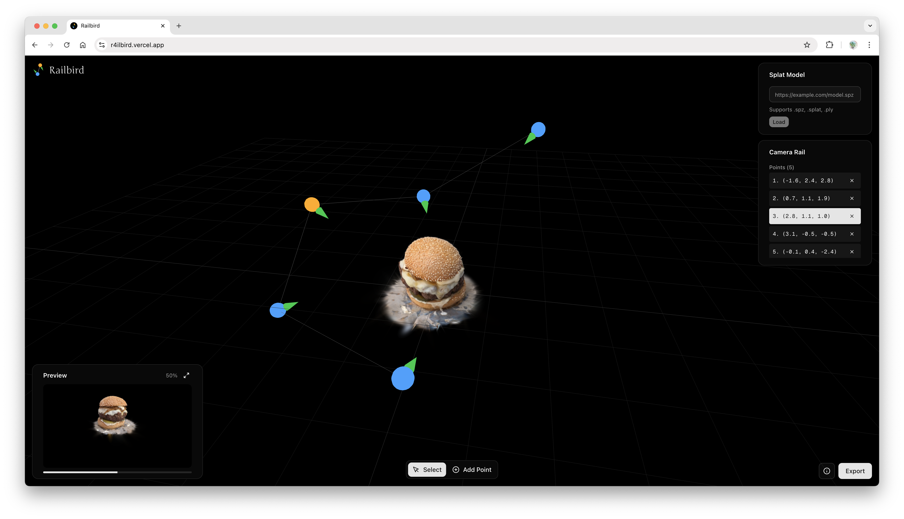

# Railbird

Railbird is a creative prototyping tool for designing scroll-driven camera animations through any Three.js scene. Build camera rails, preview scroll-bound playback, and export configurations for use in your own projects.



---

## Features

- **Camera Rail Editor** — Define control points to create smooth camera paths through your scene
- **Dual Viewport** — Edit in free-camera mode, preview in scroll-driven player mode
- **Scroll-Driven Playback** — Camera position mapped to scroll progress (`t ∈ [0, 1]`)
- **Export to JSON** — Portable configuration for integration into any Three.js project
- **Model-Agnostic** — Works with Gaussian Splats (`.spz`, `.splat`, `.ply`), and any Three.js content

---

## Getting Started

### Prerequisites

- Node.js 18+
- npm or yarn

### Installation

```bash
git clone https://github.com/thmslhst/railbird.git
cd railbird
npm install
```

### Run the Development Server

```bash
npm run dev
```

Open [http://localhost:3000](http://localhost:3000) in your browser.

---

## How to Use

### 1. Load Your Scene

Enter a URL to your 3D content. Currently supports Gaussian Splat files (`.spz`, `.splat`, or `.ply`).

### 2. Build Your Camera Rail

Switch to **Editor Mode** to navigate freely with orbit controls:

- **Left-click + drag** — Rotate camera
- **Right-click + drag** — Pan
- **Scroll** — Zoom

Position your camera and click **Add Control Point** to save that pose to the rail. Add multiple points to define your camera path.

### 3. Preview the Animation

Switch to **Player Mode** to see the scroll-driven preview. Scroll within the player viewport to scrub through the camera rail animation.

### 4. Export

Click **Export** to download a JSON configuration file containing your camera rail and scene reference. Use this with your own Three.js setup or a future `@railbird/player` package.

---

## Tech Stack

| Technology | Purpose |
| ---------- | ------- |
| [Next.js](https://nextjs.org) | App framework (App Router) |
| [TypeScript](https://www.typescriptlang.org) | Type safety |
| [Three.js](https://threejs.org) | 3D rendering |
| [Spark.js](https://github.com/sparkjsdev/spark) | Gaussian Splatting |
| [Tailwind CSS](https://tailwindcss.com) | Styling |
| [shadcn/ui](https://ui.shadcn.com) | UI components |

---

## Architecture

Railbird separates concerns into distinct systems:

```text
src/
├── app/                    # Next.js pages and layout
├── components/             # React components (UI + view wrappers)
│   ├── EditorView.tsx      # Free-camera editing viewport
│   ├── PlayerView.tsx      # Scroll-driven preview viewport
│   ├── RailEditor.tsx      # Control points panel
│   └── ui/                 # shadcn/ui components
└── systems/                # Pure TypeScript, no React
    ├── scene.ts            # Three.js scene management
    ├── viewport.ts         # Base renderer + camera
    ├── editor-viewport.ts  # OrbitControls + grid
    ├── player-viewport.ts  # Rail-driven camera
    └── camera-rail.ts      # Control points + interpolation
```

**Key principles:**

- Three.js objects live in refs, not React state
- Camera rail is a pure function: `t → camera pose`
- Each viewport has its own scene + content instance (WebGL isolation)
- Rail system is content-agnostic — works with any Three.js objects

See [architecture.md](./architecture.md) for detailed technical documentation.

---

## Export Format

Railbird exports a portable JSON configuration:

```json
{
  "version": "1.0",
  "scene": {
    "url": "https://example.com/scene.spz"
  },
  "rail": {
    "controlPoints": [
      {
        "id": "cp-1",
        "position": [5, 2, 3],
        "quaternion": [0, 0, 0, 1]
      }
    ]
  }
}
```

This separates your creative work (the camera path) from the rendering implementation, allowing integration with any Three.js setup.

---

## Supported Formats

| Format | Extension |
| ------ | --------- |
| Spark Compressed | `.spz` |
| Standard Splat | `.splat` |
| Point Cloud | `.ply` |

Future support planned for `.glb`, `.gltf`, `.obj`, and other Three.js-compatible formats.

---

## Roadmap

- [ ] Catmull-Rom spline interpolation for smoother paths
- [ ] Timeline scrubber with easing controls
- [ ] `@railbird/player` embeddable package
- [ ] Support for glTF/GLB models
- [ ] Multiple objects per scene
- [ ] Lighting and shader presets

---

## License

MIT
